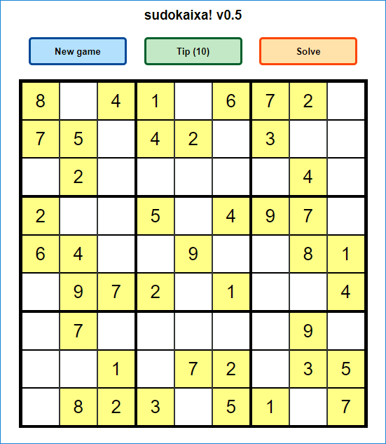
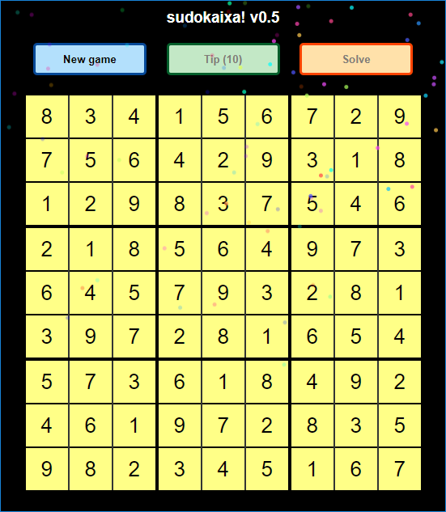

# Sudoku Game (Yet Another One)

Last year the company I work runned their own internal hackathon, trying to find and map shadow IT developers.

To finish the registration, developers should submit an html game (like snake, sudoku). The rules were:

* Only one html file; and
* Pure JavaScript (no external dependencies, assets, libs).

[**Live demo here!**](http://delarco.com.br/games/sudoku-js)

## Development

* Since there were no rules for CSS, every animation uses it.
* Works on IE, Edge, Firefox and Chrome.
* For the fireworks animation, I used the **Eddie Lin's** [Pure CSS Fireworks](http://jsfiddle.net/elin/7m3bL/).
* The algorithm for board generate was based on **The ANZAC's** code available [here](https://www.codeproject.com/Articles/23206/Sudoku-Algorithm-Generates-a-Valid-Sudoku-in).

## Screenshots

## Resources

* <http://delarco.com.br/games/sudoku-js> (live demo)
* <https://www.codeproject.com/Articles/23206/Sudoku-Algorithm-Generates-a-Valid-Sudoku-in>
* <http://jsfiddle.net/elin/7m3bL> (Pure CSS Fireworks)